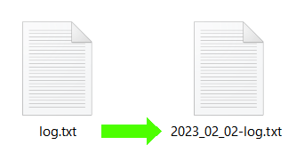
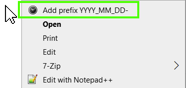
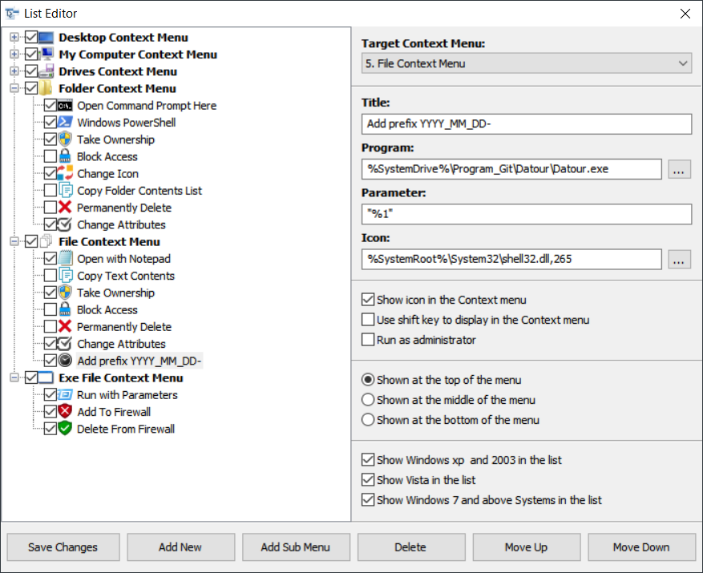
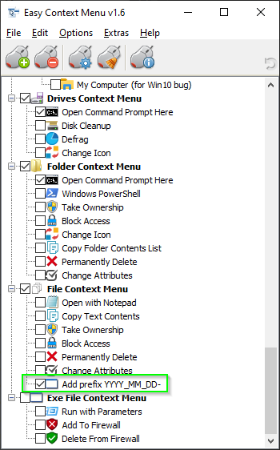

# Datour
Datour ("Date-Hour") is a small headless software to rename files with a prefix "YYYY_MM_DD-", corresponding to the modification date of the file.

The purpose of this software is to be used as a contextual menu option (mouse right click on a file), as an invisible CLI with a software like Easy Context Menu.

## Datour
Download latest release of Datour, and unzip it at a custom location ("C:\Program Files\Datour-vX.X.X").

https://github.com/marckruzik/Datour/releases

## Easy Context Menu
Download Easy Context Menu:

https://www.sordum.org/7615/easy-context-menu-v1-6/

You don't have to install Easy Context Menu, you have to unzip it and run it from any location, to edit Windows data.

* Unzip Easy Context Menu
* Launch the exe (base x86 or x64)
* File > List Editor
* In the list, find "File Context Menu" > Left click
* Under the list > Add New
* Browse and select Datour-vX.X.X.exe
* Edit properties (see screenshot below, or follow instructions)
* Do not edit Target Context Menu (5. File Context Menu)
* Title: Add prefix YYYY_MM_DD-
* Program: (the Datour.exe path you chose with the browsing window)
* Icon: %SystemRoot%\System32\shell32.dll,265
* Select "Shown at the top of the menu" (or any other, it's a personal preference)

* Click the button Save Changes
* Close the List Editor
* You are now back at the initial window (see screenshot below)

* In the list, find "File Context Menu"
* check "Add prefix YYYY_MM_DD-"
* File > Apply Changes
* Close Easy Context Menu

You can now right click on a file and edit its name.

## Shortcomings
* There is a black console that appears a split second. It should not happen, as it is a WinExe project. Maybe it's because the exe is built on Linux (see [workflow](.github/workflows/Build_and_Release.yml)).
* It has a limit of 15 files. When selecting more than 15 files, the context menu option will no longer appear.
  * This is a Windows limitation, to avoid performance issues (see related [here](https://learn.microsoft.com/en-us/troubleshoot/windows-client/shell-experience/context-menus-shortened-select-over-15-files)).
  * I do not know if Easy Context Menu can circumvent this 15 files limit.
* It cannot rename a directory, it is for files only. And directory modification dates cannot be trust. If it became a new feature, it would detect the modification dates of all files, and choose the most recent date.
* When renaming several files at the same time, they can try to edit the log file at the same file and it causes a crash.
  * The crash comes after the renaming, so the renaming works, but the log file is not edited with a new log line.
