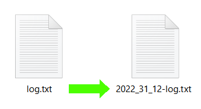

# Datour
A small headless software to rename files with a prefix "YYYY_MM_DD-", corresponding to the modification date of the file.

The purpose of this software is to be used as a contextual menu option (mouse right click on a file), as an invisible CLI with a software like Easy Context Menu.

